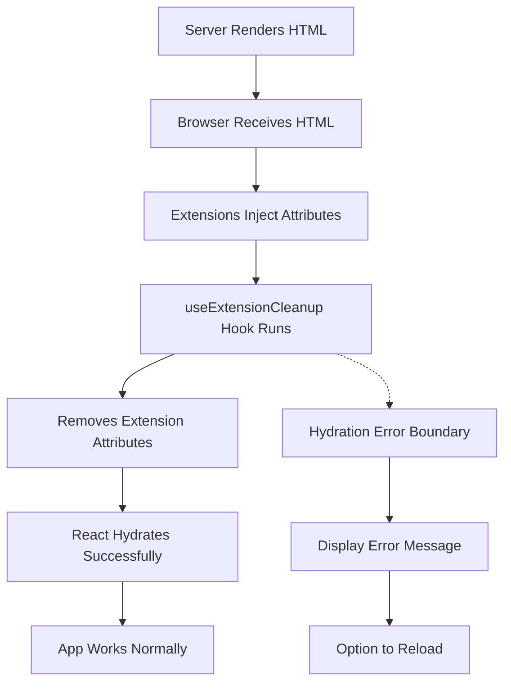

# Hydration Mismatch Fix Plan

## Problem Analysis

### Root Cause
The hydration mismatch error is caused by browser extensions (likely Hotjar, analytics tools, or similar) injecting `data--h-bstatus="0OBSERVED"` attributes into the HTML after server-side rendering but before React hydrates on the client.

### Error Details
```
A tree hydrated but some attributes of the server rendered HTML didn't match the client properties.
```

The mismatch shows:
- Server: Elements have `data--h-bstatus="0OBSERVED"` attributes
- Client: Elements don't have these attributes

### Why This Happens
1. Server renders HTML without extension attributes
2. Browser receives HTML and extensions inject their tracking attributes
3. React attempts to hydrate and detects the mismatch
4. React throws hydration error

## Solution Strategy

We'll implement a **comprehensive three-layer approach**:

### Layer 1: Cleanup Extension Attributes (Client-Side)
Create a custom hook that removes extension-injected attributes before React hydrates.

**Benefits:**
- Maintains hydration integrity
- Works with any extension that injects attributes
- No false positives

### Layer 2: Suppress Hydration Warnings (Defensive)
Add `suppressHydrationWarning` to elements where mismatches are acceptable.

**Benefits:**
- Prevents console warnings
- Allows for legitimate differences (e.g., time-based content)
- Quick fallback for edge cases

### Layer 3: Error Boundary (Safety Net)
Add error boundary to gracefully handle hydration failures.

**Benefits:**
- Prevents app crashes
- Provides better user experience
- Logs errors for debugging

## Implementation Steps

### Step 1: Create `useExtensionCleanup` Hook
**File:** `src/hooks/use-extension-cleanup.ts`

This hook will:
- Run once after mount
- Remove all `data--h-bstatus` attributes from DOM
- Clean up other common extension attributes
- Log removed attributes for debugging

### Step 2: Create Hydration Error Boundary
**File:** `src/components/hydration-error-boundary.tsx`

This component will:
- Catch hydration errors
- Display user-friendly error message
- Provide option to reload
- Log error details

### Step 3: Update Root Layout
**File:** `src/app/[locale]/layout.tsx`

Changes:
- Add `suppressHydrationWarning` to `html` and `body` tags
- Integrate cleanup hook
- Wrap with error boundary

### Step 4: Update Theme Provider
**File:** `src/components/theme-provider-client.tsx`

Enhance existing mounted check to include cleanup logic.

### Step 5: Update Page Component
**File:** `src/app/[locale]/page.tsx`

Add `suppressHydrationWarning` to elements that use time-based values.

## Architecture Diagram



## Testing Strategy

### Development Testing
1. Start dev server
2. Check browser console for hydration errors
3. Verify app loads without errors
4. Test with and without extensions

### Production Testing
1. Build production bundle
2. Test in production environment
3. Monitor for hydration errors
4. Verify user experience

### Edge Cases to Test
- Multiple extensions installed
- Extensions that inject different attributes
- Slow network conditions
- Different browsers (Chrome, Firefox, Safari)

## Rollback Plan

If issues arise:
1. Remove error boundary
2. Remove cleanup hook
3. Keep `suppressHydrationWarning` attributes
4. Monitor for errors

## Success Criteria

✅ No hydration mismatch errors in console
✅ App loads successfully in production
✅ Works with various browser extensions
✅ No performance degradation
✅ Clean error handling if hydration fails

## Future Considerations

1. **Monitoring**: Add error tracking (Sentry, LogRocket) to monitor hydration errors
2. **Performance**: Measure impact of cleanup hook on initial render
3. **Extensibility**: Make cleanup hook configurable for different extension patterns
4. **Documentation**: Add to project README for future developers

## Related Files to Modify

- `src/hooks/use-extension-cleanup.ts` (NEW)
- `src/components/hydration-error-boundary.tsx` (NEW)
- `src/app/[locale]/layout.tsx` (MODIFY)
- `src/components/theme-provider-client.tsx` (MODIFY)
- `src/app/[locale]/page.tsx` (MODIFY)

## Estimated Impact

- **Code Changes**: Low (~100 lines of new code)
- **Performance Impact**: Negligible (runs once on mount)
- **Risk Level**: Low (defensive programming approach)
- **Maintenance**: Low (self-contained solution)
